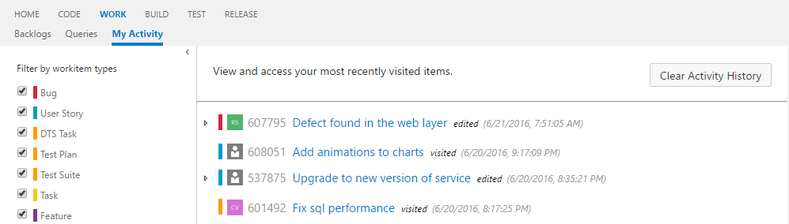

## My Work Item Activity #

An [extension](https://marketplace.visualstudio.com/items?itemName=ms-devlabs.vsts-extension-workitem-activities) for [Team Services](https://www.visualstudio.com/en-us/products/visual-studio-team-services-vs.aspx) and TFS "15" that tracks your work item activity and provides a page to view your recent work item views and edits. __NOTE: This is not supported on TFS 2015.__

### Overview

This extension adds a 'My Activity' hub under the Work group providing access to your recent work item views and edits.

### How it works?

This extensions works by recording each time you visit or edit a work item. When you go to 'My Activity' hub you can see your activity history and view what was changed. 

### Feedback

For bugs please use the [issue tracker](https://github.com/liang2zhu1/vstsworkitemactivities/issues) on the [GitHub repo](https://github.com/liang2zhu1/vstsworkitemactivities).

